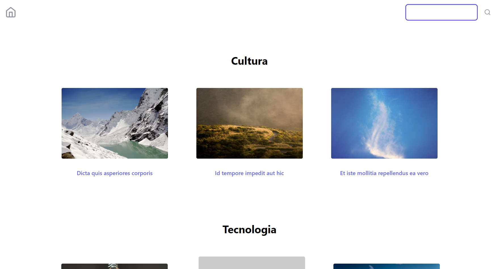
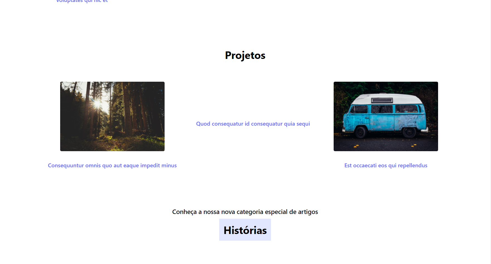
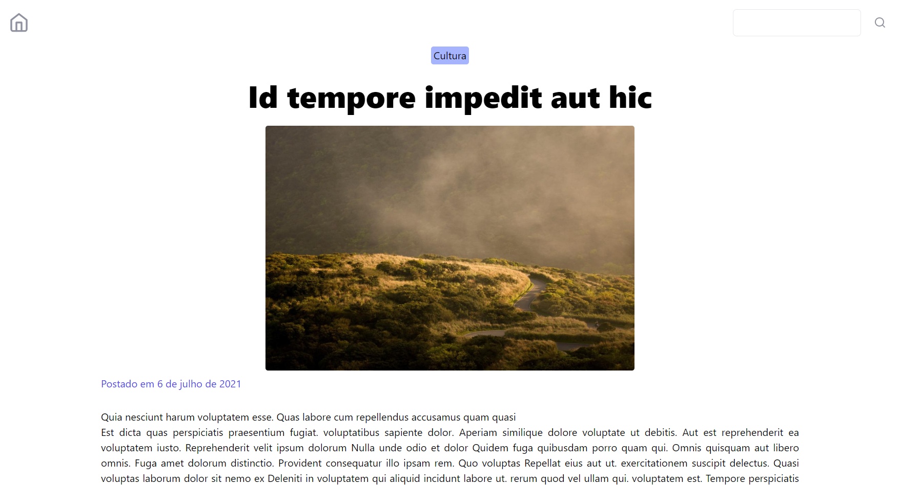
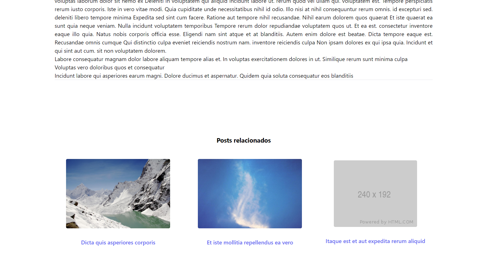
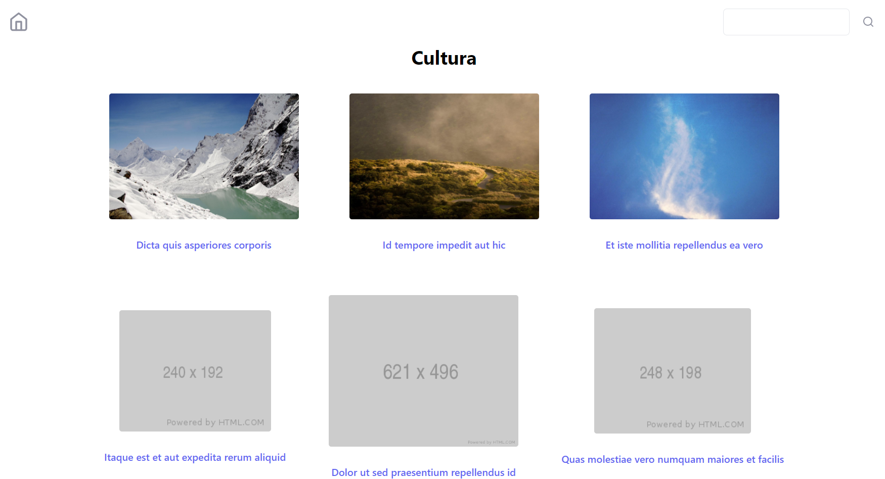
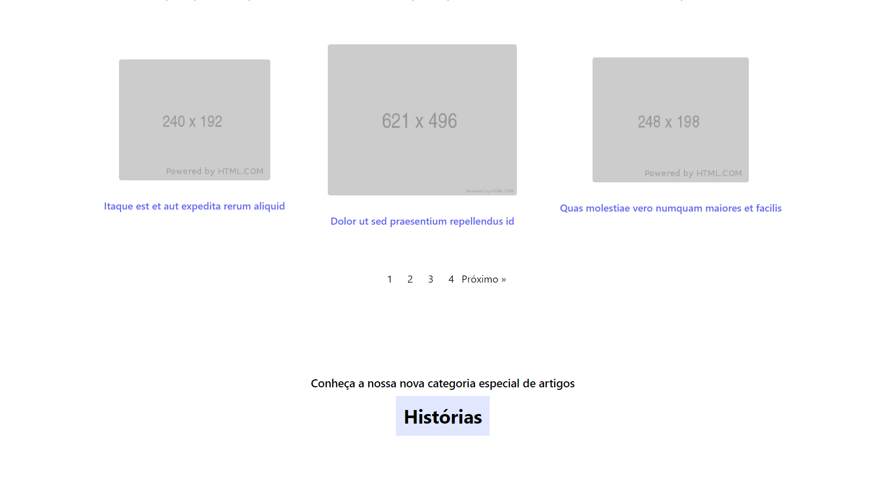
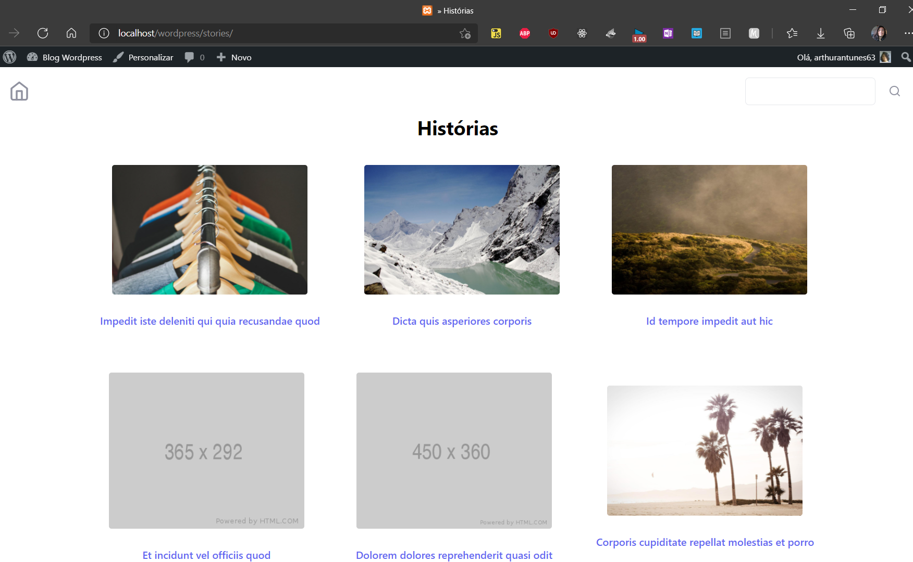
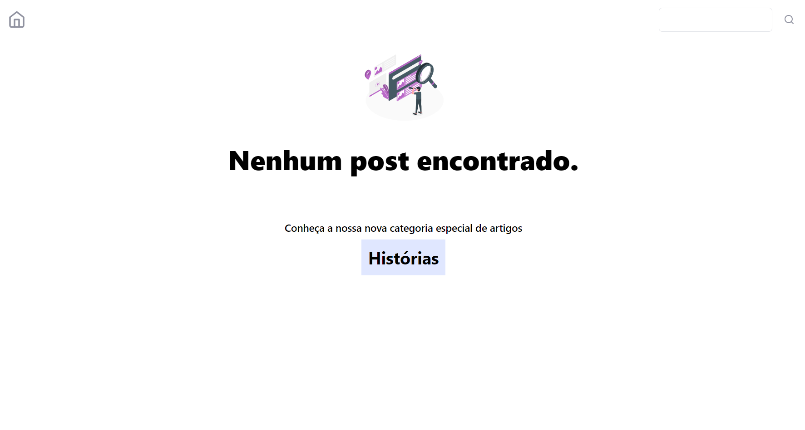

## Blog Wordpress
Código desenvolvido para concorrência de vaga de desenvolvedor na empresa `CGN`. Utilizando WordPress, PHP e CSS

#### Configuração do ambiente

Em prol de configurar um ambiente para o desenvolvimento do blog por meio do Wordpress rodando em um servidor local, no caso, a minha máquina. Se faz necessário em função do Wordpress necessitar de um servidor que suporte a linguagem PHP, Banco de dados MySQL e Apache/Ngix para funcionar, mas como irá rodar de maneira local podemos simular um serviço de hospedagem por meio do software XAMPP.

> Dentro do software podemos iniciar o serviço do Apache e gerenciar o banco de dados MySQL por meio do PHPMyAdmin. Sendo a tarefa inicial criar uma base de dados, para armazenar as informações relativas aos posts do WordPress

Tendo realizado o download do Wordpress, este pode facilmente ser instalado por meio da inserção de seus arquivos dentro do diretório `htdocs` no xampp. Sendo o serviço acessível no Apache por meio da rota equivalente ao nome do diretório escolhido.

#### Tema Básico
    Escolhi realizar a configuração inicial sem um gerador de código para maior compreensão da hierarquia do WordPress e funcionamento da disposição dos posts, recuperação das informações e funcionamento das rotas por meio dos permalinks, ou seja, compreender o emprego das funções nativas do WordPress.
> Os arquivos essenciais para a criação do tema são os arquivos style.css e index.php
- Para otimizar a utilização de código, dividir em mais componente, podemos adicionar um diretório no projeto, o 'includes'/'inc', caso queremos recuperar esses "componentes php" podemos utilizar a função nativa `get_template_part()`. 

#### Geração de Posts
A instalação de plugins pode ser realizada de maneira rápida por meio da aba plugins, o utilizado foi o FakerPress que foi configurado com as cinco categorias escolhidas e Post Type customizado para a geração de conteúdo para a realização de testes;


#### Framework CSS: `Tailwind`
O framework escolhido para a estilização foi o tailwind, pois este permite uma maior customização na constituição de componentes mais específicos na página. A instalação escolhida foi por meio do arquivo css compilado, que pode ser  gerado a partir da ferramente npx instalado juntamente com o npm, portanto, havendo a necessidade do Node.js:
    `npx tailwindcss -o tailwind.css`
Carregando esta folha de estilo podemos facilmente empregar a framework no processo de desenvolvimento com sua adição na pasta `css` do projeto, mas sempre lembrando de carregar as folhas de estilo e script por meio do `functions.php`, adicionando estes na "fila" para serem gerenciados pelo Wordpress.

#### Recuperação de Posts
Um dos conceitos mais importantes para se entender é como se dá a recuperação de posts, sendo ocorrida por meio do "Loop":

> Estrutura básica do "Loop" (recuperar conteúdo de posts)
> ```php
>   <?php if( have_posts() ): while( have_posts() ): the_post()?>
>   <?php the_content() ?>
>   <?php endwhile; else: endif;?>
>   
> ```

Sendo que amplamente foi empregado queries que eram realizadas sobre os posts, através da instanciação de um objeto da classe `WP_Query` com os dados parâmetros em função do post que desejava recuperar, como procedeu-se com as categorias.

#### Resultado
##### Página Inicial

##### Footer padrão

##### Página do Post



##### Categoria



##### Post Type "Histórias"


##### Pesquisas



#### Impressões Finais
Não havia tido tanto contato com o Wordpress e o PHP, mas consegui compreender o funcionamento geral da recuperação de posts da base de dados, por meio das funções nativas do WordPress, e a sintaxe da linguagem PHP, em função de já ter uma ótima base em outras linguagens, como o Python, sendo que as estruturas e conceitos em si são comuns a elas. Além disso, tenho um contato maior com o desenvolvimento web, sobretudo no front-end, permitindo assim que a utilização do framework Tailwind fosse facilmente gerenciável dada à compreensão que tenho do css *vanilla*.